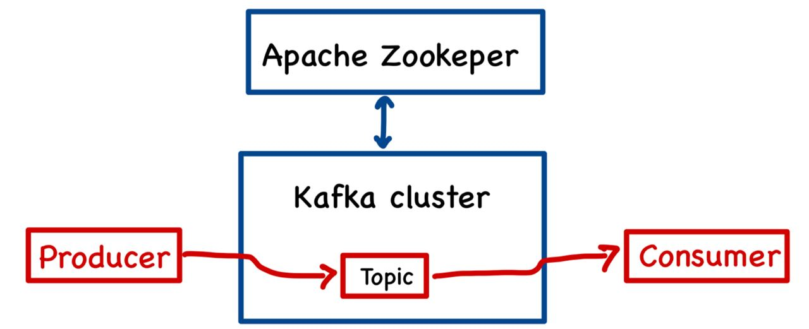
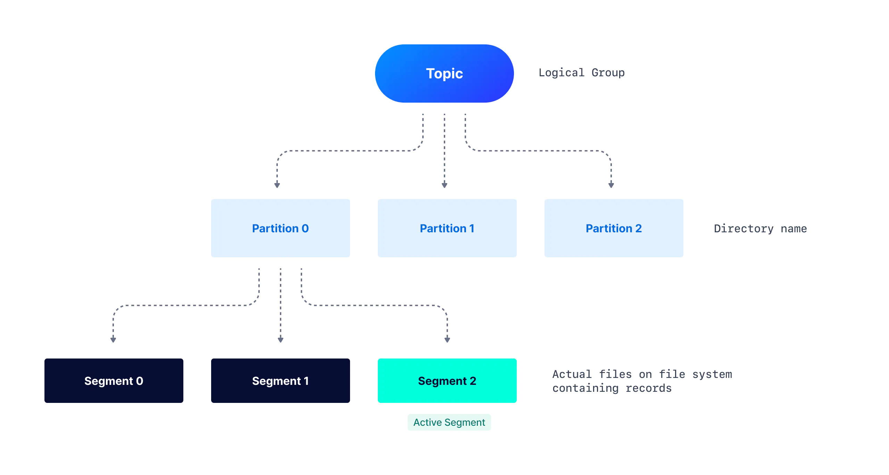

# Введение
Kafka - брокер сообщений, способный выдерживать большие нагрузки.

Схема компонентов кафки:  

1) Zookeeper - инструмент для координации. Следит за состоянием узлов и исходя из этого координирует чтение/запись. 
В 2024 году планируется отказаться от Zookeeper в пользу встроенный в кафку KRaft.  
2) Kafka cluster - сервер, содержащий топики и отвечающий за передачу сообщений.
3) Kafka Topic - непосредственно топик, хранящий сообщения.
4) Consumer/Producer - отправитель и получатель данных.

Топики представляют собой не просто большую очередь для хранения сообщений. Каждый топик делится на **партиции** 
(partition). Внутри партиции и находится очередь из сообщений. Механизм партиций необходим для распаралеливания 
процесса. Ведь вместо того, чтобы читать всем из одной большой очереди, лучше разделить очередь на очереди поменьше
и читать уже **без конкурентного** доступа оттуда. Каждую партицию читает только один процесс получателя. Сообщения 
между партициями разделяются на основе некоторых правил, упрощено можно считать, что сообщение может попасть в любую
из партиций и распределение между партициями равномерное. Таким образом, для высоконагруженных систем можно сделать 
кучу партиций, поднять кучу инстансов сервисов и держать таким образом большую нагрузку.

Все получатели объединяются в группы (consumer group). Например, может быть несколько групп (аналитиков, безопасников,
бизнес сервисов) и каждая из групп читает сообщение из топика для своих целей. Важно, что каждая группа читает топик 
**независимо** и не мешая друг другу. Если группа аналитиков прочитала 35 сообщение из очереди и упало, то это не 
помешает другим группам (они даже ничего не узнают) и после сбоя группа аналитиков сможет читать сообщения с того же 
места.

## Kafka CLI
Производить различные действия с кафкой можно при помощи различных утилит, поставляемых вместе с кафкой в папке `bin`.
Это инструменты командной строки (Command Line Instrument). Приведу неполное описание, по остальным утилитам
можно найти информацию в интернете:
1) kafka-server-start.sh - запускает Kafka Server, используя передаваемый файл с конфигами (sample файл поставляется 
вместе с кафкой).
2) kafka-server-stop.sh - останавливает Kafka Server.
3) zookeeper-server-start.sh - запускает Zookeeper Server, используя передаваемый файл с конфигами.
4) zookeeper-server-stop.sh - останавливает Zookeeper Server.
5) kafka-cluster.sh - получить ID кластера Kafka.
6) zookeeper-shell.sh - присоединиться к Zookeeper shell.
7) kafka-broker-api-versions.sh - получить информацию о брокере.
8) kafka-topics.sh - создать/изменить/удалить топик.
9) kafka-delete-records.sh - удалить данные из партиции.
10) kafka-console-producer.sh - тестовый продюсер для записи данных в топик из консоли.
11) kafka-console-consumer.sh - тестовый консюмер для чтения данных из топика в консоли. 
12) kafka-producer-perf-test.sh - позволяет записать большое количество данных в топик для нагрузочного тестирования.
13) kafka-consumer-groups.sh - получение активных групп получателей.

## Логи
Кафка пишет логи в папку `logs`. Основные логи пишутся в файл `server.log`, вспомогательные в различные другие файлы.

## Конфиги для получателей
`AutoOffsetReset = [latest, earliest, none]`  
Задает логику чтения для получателей, у которых не записан `offset` по топику:  
`latest` - пропустить все старые записи и начать чтение с новых сообщений.  
`earliest` - прочитать все сообщения из топика, затем получать новые сообщения.  
`none` - выкинуть ошибку, если offset для получателя не задан.

`EnableAutoCommit = [true|false]`  
Если true, то получатель будет автоматически отправлять offset по топику.

# Очистка данных
Кафка поддерживает две политики очистки данных:
1) Хранение до достижении определенного времени/размера
2) Очистка данных по ключу

Механизмы могут быть активированы одновременно или по отдельности. Хранение только по времени может быть неразумно, 
поэтому поэтому лучше использовать по времени + по месту. По умолчанию данные хранятся 7 дней без ограничения по 
размеру.Настраиваться политика может на уровне брокера (применяется ко всем топикам) или на уровне топика (применяется 
только к этому топику). 

Однако стоит помнить про то, как хранятся данные в партиции, чтобы лучше понимать логику очистки данных:

Каждая партиция состоит из набора файлов, называемого сегментами. Новые сообщения записываются в 
открытый/головной/активный сегмент. Закрытые сегменты хранятся на диске и не могут быть дополнены новыми записями. 
Удаление происходит посегментно, т.е. файл сегмента удаляется целиком. Используется следующий алгоритм:
1) берется очередной закрытый сегмент
2) вычисляется разница между максимальным timestamp сообщений сегмента и текущим временем
3) эта разница сравнивается с настройкой и если она больше, то сегмент помечается к удалению
4) через некоторое время файлы удаляются отдельным потоком с файловой системы

# Отказоустойчивость
Для минимально оптимальной отказоустойчивости необходимо следующее:
1) 3 брокера Kafka
2) 3 брокера Zookeeper
3) Все брокеры должны находиться на разных серверах

3 брокера кафки необходимо, чтобы равномернее распределить нагрузку. Если изначально брокера было 2 и 1 из них умер, то
оставшийся брокер может загнуться под всеми запросами, которые в него полетят.

