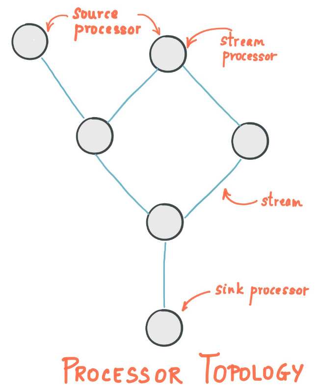
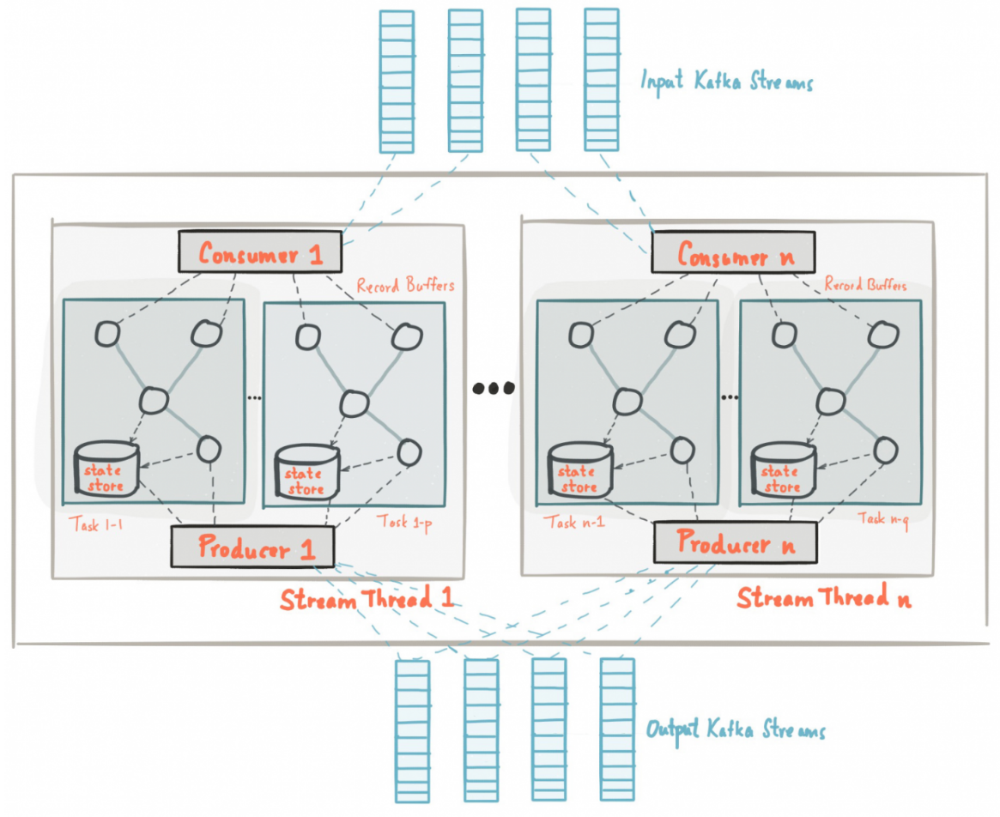

# Kafka Streams

## Проблематика и особенности
Kafka streams - java библиотека, которая позволяет настраивать пайпы данных из одного топика в другой. Пайпа эта 
позволяет изменять, агрегировать, фильтровать данные. Из коробки kafka streams умеет поддерживать exactly once 
обработку. Достигается это путем kafka транзакций и гарантий чтения/доставки сообщений. Есть поддержка fault tolerance 
для агрегирования данных, данные могут храниться на диске. Для этого используется RocksDB или топик кафки. Благодаря
базису на основе kafka легко поддерживается многопоточная обработка данных.

Самый простой способ написания критически важных приложений реального времени и микросервисов (с) документация Kafka 

## Основные концепции


Топология представляет собой ацикличный граф обработки данных

- **Источник (source proccessor)** - самый первый элемент графа обработки, забирает данные из определенного топика
- **Обработка (stream proccessor)** - обрабатывающие узлы, могут фильтровать, преобразовать и агрегировать данные
- **Хранилище состояния (state processor)** - необходимы обрабатывающим узлам для агрегаций или join операций
- **Sink processor** - выходной узел, отправляет данные в некий другой топик

Усредненная архитектура Kafka Streams сервиса:


## Источник

```java
KStream<String, RateEntityStatistics> stream = 
        builder.stream(
                Pattern.compile("somePatternString"),
                Consumed.with(Serdes.String(), new RateEntityStatisticsSerde())
        );
```

## Потоковый процессор

При помощи потокового процессора можно фильтровать по ключу/значению:

```java
builder.stream("exchange-operations", Consumed.with(Serdes.String(), Serdes.Double()))
        .filter((currency, amount) -> currency.equals("USD") && amount > 100)
        .to("big-usd-exchange-operations");
```

Можно преобразовывать данные (и ключ и значение). Важное уточнение, при изменении ключа будет происходить 
repartitioning, которая может негативно сказаться на производительности:

```java
builder.stream("exchange-operations", Consumed.with(Serdes.String(), Serdes.Double()))
                .map((currency, amount) -> {
                    if (currency.equals("USD")) {
                        currency = "Zuzubliki";
                    }
                    return KeyValue.pair(currency, amount); // !
                })
                .mapValues((currency, amount) -> {
                    if (currency.equals("CNY")) {
                        return amount * 100;
                    }
                    return amount;
                })
                .to("processed-exchange-operations");
```

И агрегация:

```java
builder.stream("exchange-operations", Consumed.with(Serdes.String(), Serdes.Double()))
                .groupByKey()
                .windowedBy(TimeWindows.of(Duration.ofMinutes(1).toMillis()))
                .count()
                .toStream()
                .to("exchange-operations-by-currency");
```

## State Stores
Механизм, который сохраняет состояние для потокового процессора (в необходимых на то операциях). По умолчанию 
используется RocksDB под каждый инстанс сервиса (а значит под партицию/группу партиций). Помимо RocksDB это может
быть Kafka Topic, In memory, Custom решение. 

В коде для этого используются следующие интерфейсы:
- KStream - поток данных ключ-значение
- KTable - хэш-таблица, содержащая ключ и последнее значение ассоциированное с этим ключом. Одно на инстанс
- GlobalKTable - то же самое, что и KTable, только глобально на весь топик. Подключается из нескольких инстансов сервиса

State Stores из коробки кэширует данные/операции для оптимизации запросов записи. Из-за этого могут возникать проблемы
похожие на кэш хибернейта.

Вообще Kafka не советует использовать KTable для произвольных запросов на чтение и запись, но не все этому следуют. 
Отсюда вообще вытекают большой пласт проблем связанный с тем, что RocksDB может не тянуть большое количество данных
и тут начинается распределение этой БД: вступает в силу партиционирование, масштабирование, сжатие, холодное хранилище 
данных и прочие ужасы (все еще помнят, что кафка это просто месседж брокер?)