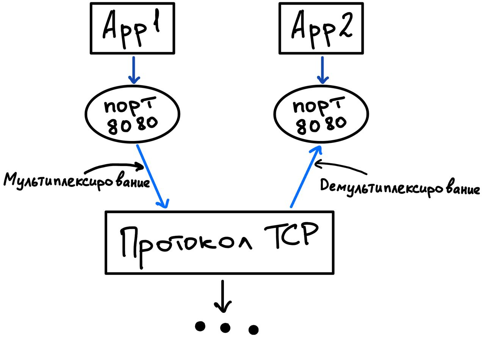

# Транспортные протоколы TCP и UDP

## Порт
Порт - очередь данных из интернета в приложение и обратно. Для удобства, две эти 
очереди объединяют в одну и дают ей порядкой номер. Бывают TCP и UDP порты. В рамках одного ПК номера разных 
типов портов могут повторяться.

## Мультиплексирование и демультеплексирование
Это операции взаимодействия между портом и сетевым интерфейсом:
 

## Сокет
Сокет (Socket API) - интерфейс, позволяющий обмениваться информацией между двумя приложениями по сети.
Сокет (идентификатор) - совокупность IP адреса и порта, однозначно определяющие прикладной процесс.

## Протокол UDP
Протокол UDP реализует доставку по возможности и не гарантирует доставку адресату. 
В противовес этому, протокол очень быстрый, так как ничего не проверяет и не мониторит. 
Отстрелил сообщение и забыл.